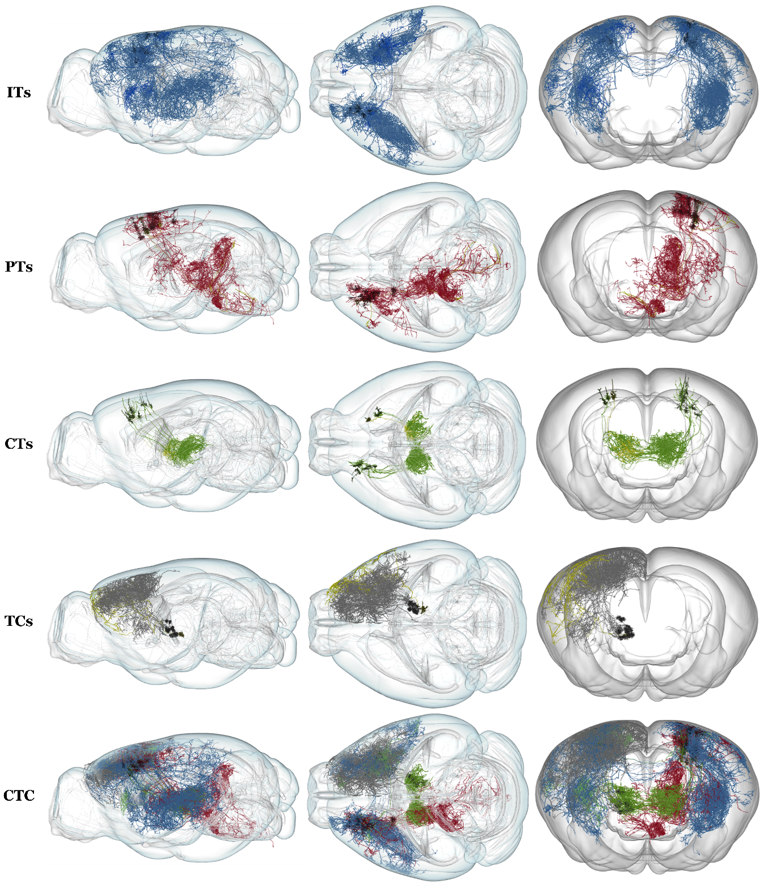
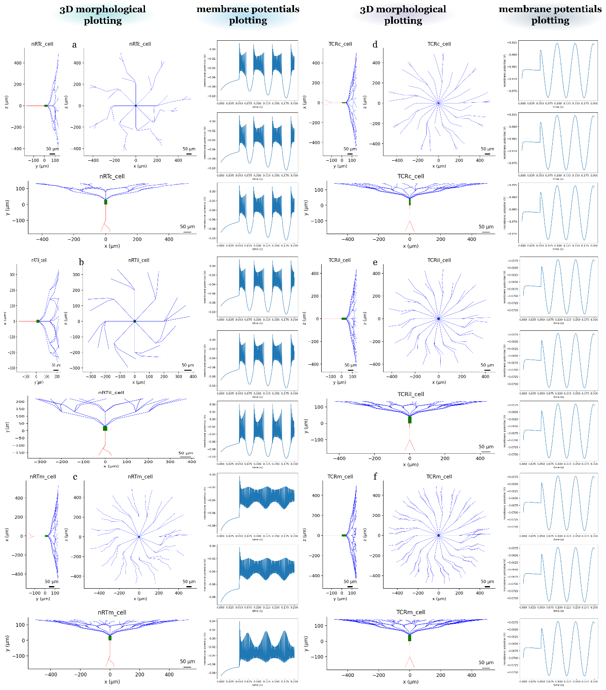
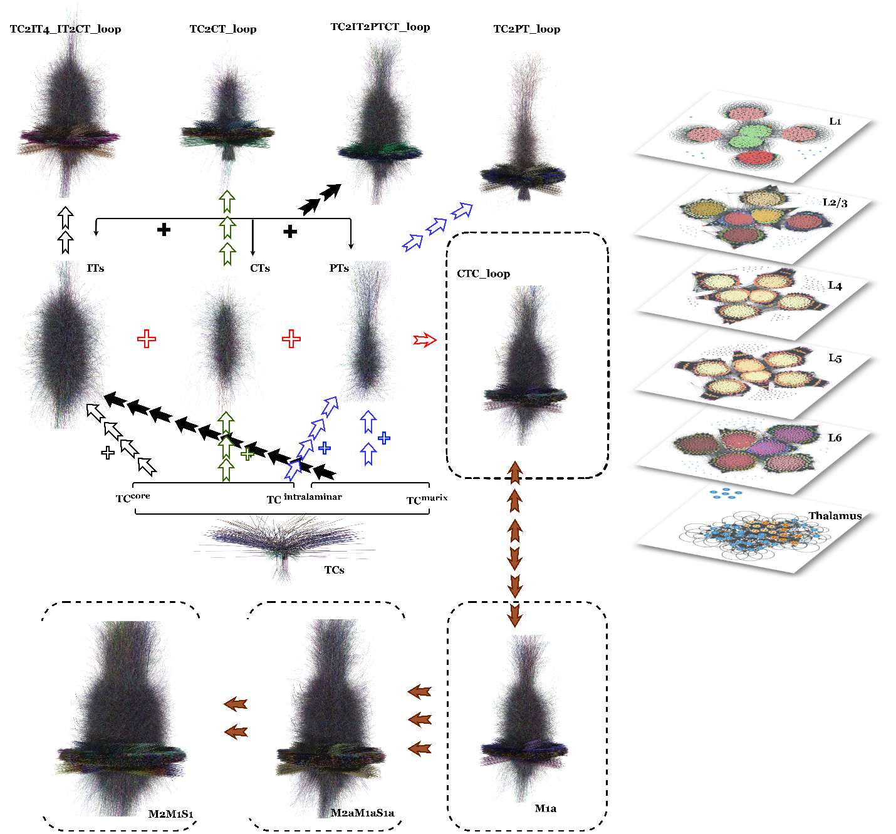
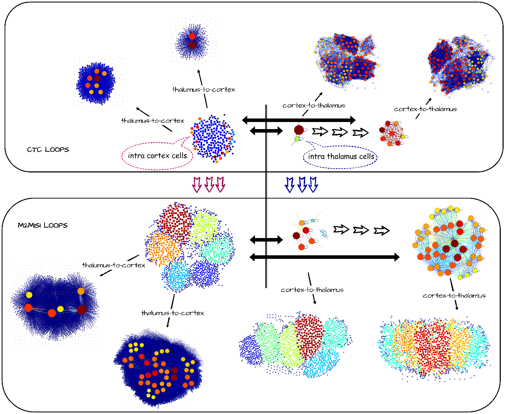
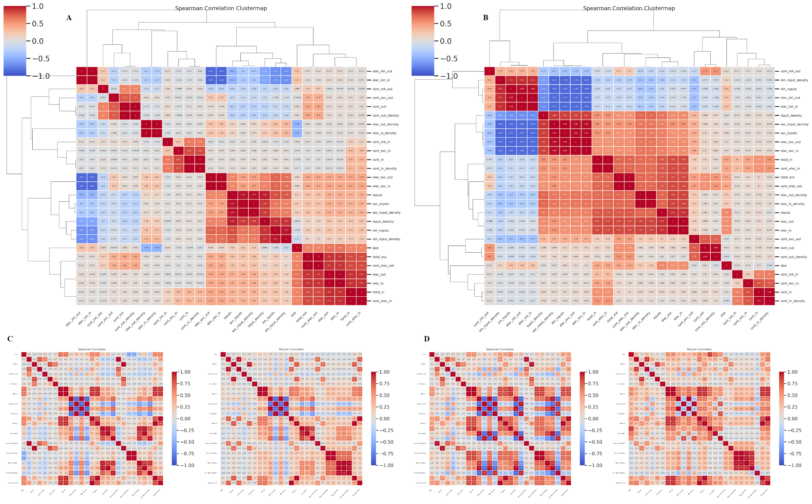
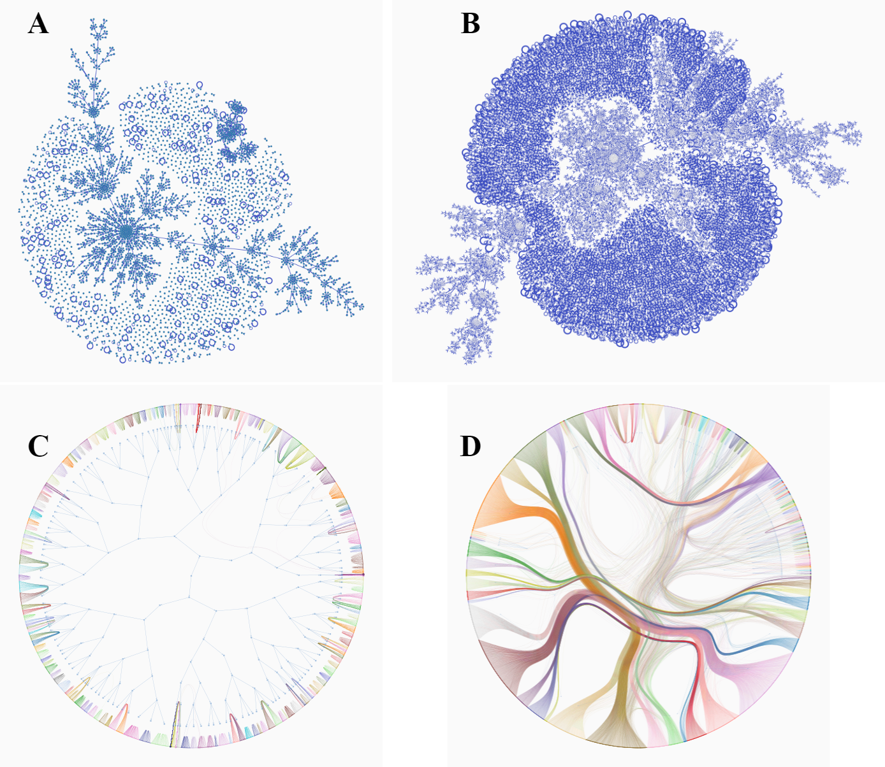
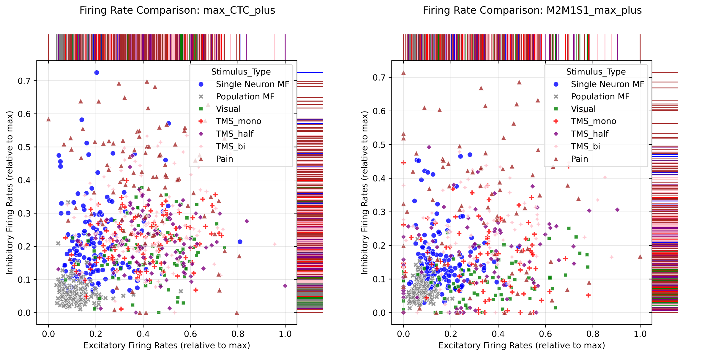
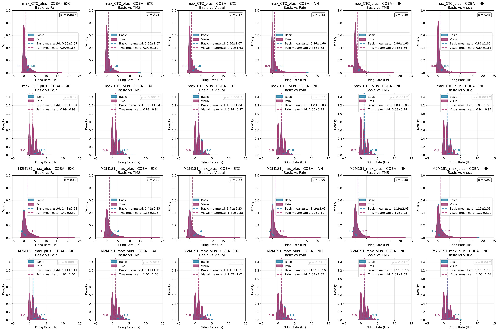
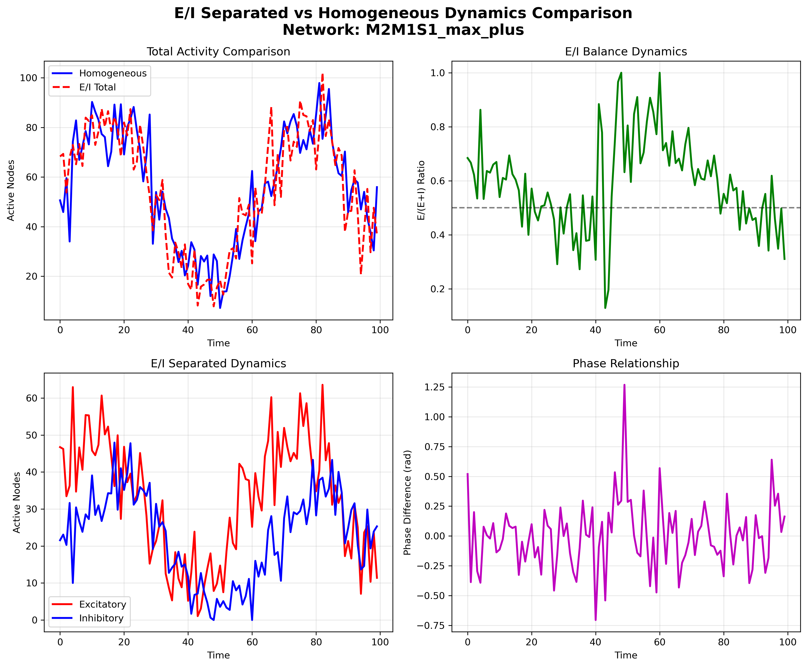
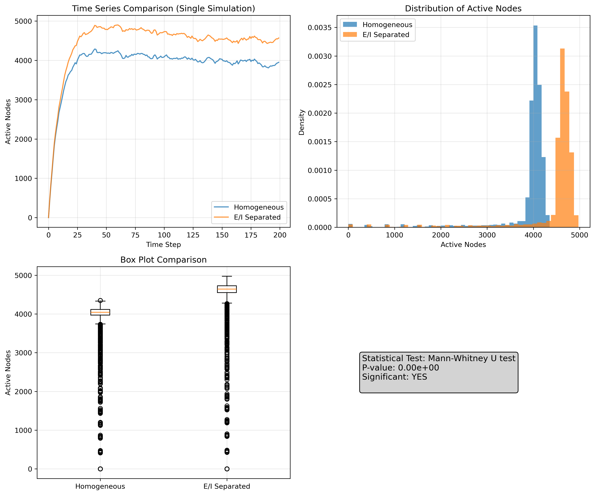

# Abstract 

Macro-scale cortico-thalamo-cortical (CTC) models increasingly linking
microcircuit structure to system dynamics, but often omit
morphologically distinction in what thalamic projection classes can
shape, which limits mechanistic insights. This study presents a
reproducible computational framework introduced that integrates six
morphologically validated thalamic neuron classes (TCRil/TCRm/TCRc and
nRTil/nRTm/nRTc) into single-regional and multi-regional CTC loops
(*i.e.*, CTC and M2M1S1 circuits loops) reconstructions. Using PyNeuroML,NEST, graph-tool packages and mean-field approximation, we show that projection motifs systematically bias E/I balance, synchronization tendency, and network complexity, producing distinct responses to visual, TMS-like, and nociceptive stimuli. Results reveal that thalamic projection classes act as structural control parameters, E/I balance as state variables shaping emergent CTC dynamics in ways that align with and predict variability observed in rodent experiments.

**Keywords:** cortico-thalamo-cortical, computational neuroscience,
network dynamics, E/I balance, synchronization, PyNeuroML, NEST
simulator, graph-tool, mean-field approximation

# Introduction

The cortico-thalamo-cortical (CTC) circuits loop is central to regulates
brain sensory processing, learning and memory, sleep, plasticity, and
consciousness proved by compelling evidence for a similar role in *mus
musculus* to *homo
sapiens* [@Russo2025;@Vega-Zuniga2025].
Although large-scale computational models have clarified many aspects of
cortical function, thalamic heterogeneity---particularly differences in
projection motifs (core, matrix, intralaminar) and corresponding
reticular interactions---remains underexplored in system-level
simulations. Morphological differences among thalamic cells determine
axonal branching and synaptic placement, and therefore have the
potential to shape both local E/I balance and mesoscopic dynamics. Yet
most large-scale simulations either omit detailed thalamic morphologies
or collapse thalamic diversity into a small number of homogeneous units,
limiting the ability to form mechanistic links between cell morphology
and network behavior. Here the gap with a morpho-dynamical approach that
integrates six thalamic neuron classes, three relay classes (TCRil,
TCRm, TCRc) and three reticular classes (nRTil, nRTm, nRTc) into
large-scale CTC and M2M1S1 reconstructions is addressed. Each class is
instantiated from validated PyNeuroML [@Cannon2014;@Vella2014] 
morphologies and parameterized to reproduce key single-cell
electrophysiological signatures. Networks are assembled with explicit
projection rules motivated by experimental tract-tracing and single-cell
connectivity literature, and dynamics are probed with reproducible NEST
simulations [@Gewaltig:NEST] under visual, transcranial magnetic
stimulation (TMS)-like, and nociceptive protocols. To characterize
emergent population dynamics, we employ SIRS
(Susceptible-Infected-Recovered-Susceptible) epidemic models that
simulate state transitions across neuronal populations, comparing both
homogeneous implementations (treating all neurons identically) and
excitatory-inhibitory (E/I) separated variants (distinguishing between
excitatory and inhibitory neurons with distinct transition
probabilities). The resulting structure and dynamics were analyzed using
graph-tool inference [@peixoto_graph-tool_2014], standard network
statistics, and mean-field
approximations [@Layer2022;@Parr2019].

This trials exploration contributes a reproducible
morphological-to-network computational framework of six thalamic neuron
classes and complex neural networks dynamics manipulations. These
neuronal classes help quantitatively demonstrate that projection class
systematically modulates E/I balance (with matrix-dominant networks
displaying significantly higher median E/I ratios), synchronization
tendency (evidenced by enhanced low-frequency band power and transient
synchrony), and network complexity in large-scale CTC networks through
morphologically-determined axonal branching patterns and synaptic
placement rules. Furthermore, these structural differences yield
distinct, testable responses to common stimulation paradigms---including
visual, TMS-like, and nociceptive protocols---that align with and
predict variability observed in rodent experiments. This framework,
which integrates validated PyNeuroML morphologies with NEST simulations
and graph-theoretical analysis using stochastic block models, is
applicable to other thalamic cell classes and morphologies, and can be
extended to investigate structure-function relationships across diverse
neural systems.
<import>
<figure id="fig:fig1">

<figcaption>Representative axonal and dendritic reconstructions for cortical (IT, PT, CT) and thalamic cell classes (TC). Morphological differences underpin the projection-specific connectivity rules used to assemble the networks.</figcaption>
</figure>
</import>

# Methods

## Thalamus neurons construction

In terms of morphological, canonical NeuroML v2 files for each class
, which are TCRil, TCRm, TCRc, nRTil, nRTm and nRTc, generated by PyNeuroML.
Morphological metrics reported include total axonal length, branch order
distribution, and Sholl counts. Five variants of morphological
perturbations per class by resampling branch length and branching angles
within ±10 percent for sensitivity checks. In electrophysiology, each
class parameterized to reproduce resting potential (Vrest), input
resistance (Rin), spike threshold and F-I curve from literature. Active
conductances implemented as Hodgkin-Huxley style channels where
required; channel kinetics referenced to Nucleus Reticularis (nRT) Thalami Cell model and thalamocortical relay (TCR) cell model.
Single-cell validation runs in NEURON / PyNeuroML, dt = 0.025 ms for
validation with the metrics of spike count at standard current steps,
rheobase, adaptation index, and subthreshold impedance. Representative
traces appear in Figure 2. Create nRT and TCR neurons with newly created
and valified morphologically cell models *in silico*, including matrix
type (TCRm, nRTm), core type (TCRc, nRTc) and intralaminar type (TCRil,
nRTil). The modeling and simulation were adjusted and modified from
Bezaire [@Bezaire2016] (see Figure.2).

<import>
<figure id="fig:fig2">

<figcaption>Three-dimensional morphology renders (left) and example membrane potential responses (right) for each thalamic class. Traces show characteristic firing patterns used for single-cell validation.</figcaption>
</figure>
</import>

## Network assembly

Two main network neuronal models were instantiated, which are CTC
circuits networks with population_count $\approx 1043$ and M2M1S1
circuits networks with population_count $\approx 6258$. The neuron class
assignment in cortical and thalamic population compositions follow
literature proportions where
available [@Henry2015;@Ramaswamy2015;@Reimann2015;@Traub2005].
A default cortical excitatory:inhibitory ratio of 60:40 and assigned
thalamic class fractions according to the projection-motif definitions
described above when data are unavailable.

Connectivity rules in the simulation network connectivity were generated
from class-pair projection rules and sampled probabilistically, which
are adjusted from previously works of Alexandra, Clemente-Perez [@Alexandra2017], Gordon [@Gordon2021], Reimann [@Reimann2017], and Eyal [@Eyal2017].

**Cortex $\rightarrow$ Thalamus**: CT and PT axons provide cortical
inputs to thalamic relay cells. Connection probabilities are denoted
$p_{\mathrm{CT}\rightarrow\mathrm{TCR}}$ and
$p_{\mathrm{PT}\rightarrow\mathrm{TCR}}$ and are specified per
pre/post class.

**Thalamus $\rightarrow$ Cortex**: TC classes
(intralaminar/matrix/core) target specific cortical layers and
postsynaptic cell types (IT, PT, CT) according to the
projection motif tables; target layer specificity determines
postsynaptic cell pools and synapse placement.

**Synaptic contact sampling**: for each pre/post class pair we draw
a contact count from the empirical class-pair distribution (Poisson
or empirical histogram) and then place the sampled contacts across
appropriate target compartments (for example, proximal dendrites for
AMPA-dominated contacts).

For synapse models, chemical synapses (AMPA, NMDA, GABA$a$, GABA$b$)
and electrical synapses (GapJunction, GapJ) were used (features display
of synapses in Table 1). Short-term plasticity was omitted from the main
experiments and noted as a limitation; synaptic weights and delay
distributions are randomly generated for each synapse.

**Table 1:** Synaptic model parameters used in the network simulations
   Synapse Type | Model | Conductance (nS) | Reversal Potential (mV) | Rise Time (ms) | Decay Time (ms) |
   ------------ | ----- | ---------------- | ----------------------- | -------------- | --------------- |
   AMPA | expTwoSynapse | 0.368 | 0 | 1 | 2 |
   NMDA | blockingPlasticSynapse | 0.800 | 0 | 1 | 13.3 |
   GABAa | expTwoSynapse | 0.057 | -75 | 8 | 39 |
   GABAb | expTwoSynapse | 0.017 | -81 | 180 | 200 |
   AMPA-NMDA | Combined | 0.368/0.800 | 0/0 | 1/1 | 2/13.3 |
   GABA | Combined | 0.057/0.017 | -75/-81 | 8/180 | 39/200 |
   GapJ | gapJunction | 3.000 | N/A | N/A | N/A |

CTC loops constructing also includes three broad classes of excitatory
and inhibitory neurons in the neocortex, which are intratelencephalic
(ITs), pyramidal tract (PTs) and corticothalamic (CTs) neurons. The
rules of projections among neurons in CTC loops are references to the
conclusion of Gordon M. G. Shepherd [@Gordon2021]:

Cortical projections to the thalamus are composed of axons from two
of the three main classes of cortical projection neurons. CT neurons
in layer 6 project their axons almost exclusively to the thalamus,
with branches in the thalamic reticular nucleus (TRN) but few
branches intracortically [@Harris2019;@Harris2015]. The
other component of the cortical projection to the thalamus arises as
branches of 'pyramidal tract' (PT)
neurons [@Wilson2014].

The CT and PT projection patterns from a cortical site tend to be
similar, although they are not identical. Their axons project mainly
to ipsilateral thalamus, and also branch
contralaterally [@Harris2019;@Jeong2016;@Bennett2019;@Alloway2007;@Winnubst2019].

Due to the intralaminar pattern of TC axonal branching in the cortex
is a fundamental structural determinant of cellular connectivity in
CTC loops, and distinction conforms reasonably well to the
classification of the thalamus into matrix type (calbindin expressing)
nuclei and core type (parvalbuminexpressing (PV), in primates)
nuclei [@Jones1998], respectively, as a results, the
intralaminar, the matrix and core terminology are used as a proxy
for the projection defined TC classes.

The cellular connectivity in CTC loops across diverse systems,
ranging from primary sensory (S1) to motor (M1, M2). Presynaptic and
postsynaptic cell types form synaptic connections into connectivity
matrixes with specify synaptic weights. In the cortex to thalamus
direction, the presynaptic neurons are PT and CT, and the
postsynaptic neurons are matrix-type and core-type TC neurons. While
in the thalamus to cortex direction, matrix-type and core-type TC
neurons are presynaptic and postsynaptic neurons are IT, PT and CT
neurons.

Primary somatosensory cortex is the whisker-barrel system and
forelimb-related pathways of rodents, where much is now known about
cell type-specific connectivity in the CTC loops. CT axons project
core-type ventral basal complex (VB) consisting of ventral posterior
medial (whiskers) and lateral (limbs and trunk) nuclei. CT axons
also project matrix-type posterior nucleus (PO)
nucleus [@Landisman2007]. The PT axons are similar to the CT
axons, overlap anatomically with and strongly excite PO neurons.

CTC loops simulated are distributed across neocortex microcircuits with
the five cortical layers (L1, L23, L4, L5, L6) and thalamic reticular
nucleus (TRN). CTC circuits of the primary somatosensory cortex (S1),
primary motor cortex (M1) and secondary motor cortex (M2) are organized
hierarchically, with 'top-down' M2 → M1 → S1 pathways running
countercurrent to 'bottom-up' S1 → M1 → M2 pathways (see Figure.3).
<import>
<figure id="fig:fig3">

<em>T</em><em>C</em>intralaminar + <em>T</em><em>C</em>matrix → <em>P</em><em>T</em> = <em>T</em><em>C</em>2<em>P</em><em>T</em>_<em>l</em><em>o</em><em>o</em><em>p</em>  (blue
hollow arrows); <em>T</em><em>C</em>intralaminar + <em>T</em><em>C</em>core → <em>C</em><em>T</em> = <em>T</em><em>C</em>2<em>C</em><em>T</em>_<em>l</em><em>o</em><em>o</em><em>p</em>  (green
hollow arrows); <em>T</em><em>C</em>intralaminar + <em>T</em><em>C</em>matrix → <em>I</em><em>T</em> → [<em>P</em><em>T</em>,<em>C</em><em>T</em>] = <em>T</em><em>C</em>2<em>I</em><em>T</em>2<em>P</em><em>T</em><em>C</em><em>T</em>_<em>l</em><em>o</em><em>o</em><em>p</em>  (black
solid arrows); <em>T</em><em>C</em>intralaminar + <em>T</em><em>C</em>core → <em>I</em><em>T</em>4 → <em>I</em><em>T</em> → <em>C</em><em>T</em> = <em>T</em><em>C</em>2<em>I</em><em>T</em>4_<em>I</em><em>T</em>2<em>C</em><em>T</em>_<em>l</em><em>o</em><em>o</em><em>p</em>  (black
hollow arrows). CTC loops are distributed across neocortex
microcircuits and thalamic reticular nucleus (TRN).

<figcaption>Schematic of CTC loop motifs illustrating TC → PT/CT/IT
projection pathways analyzed.</figcaption>
</figure>
<import>

## Simulation protocols

All protocols utilize NEST simulator's `sinusoidal_gamma_generator` with
parrot neuron populations and spike recorders, ensuring consistent
methodology across stimulation types while allowing parameter-specific
adaptations to reflect the unique neurophysiological characteristics of
each modality.

The simulation framework implements three distinct neuromodulatory
protocols to investigate cortical network dynamics under different
physiological conditions: **Pain Stimulation**, **Transcranial Magnetic
Stimulation (TMS)**, and **Visual Stimulation**. Each protocol employs
sinusoidal gamma generators to produce controlled spike trains with
systematically varied parameters.

The visual stimulation protocol employs high-frequency stimulation with
a 100 Hz baseline rate and strong amplitude modulation (50 Hz) at 20 Hz
frequency, reflecting the high temporal precision required for visual
processing. The protocol features include modulations of DC rate,
amplitude, frequency and phase. High-intensity DC rate modulation was
set 20 $\rightarrow$ 40 $\rightarrow$ 60 $\rightarrow$ 80 $\rightarrow$
100 Hz progression to simulate varying visual contrast levels.
Large-amplitude modulation were configured as 80 $\rightarrow$ 60
$\rightarrow$ 40 $\rightarrow$ 20 $\rightarrow$ 10 Hz amplitude steps
with constant 100 Hz baseline.The high-frequency Temporal modulation
were 5 $\rightarrow$ 10 $\rightarrow$ 15 $\rightarrow$ 20 $\rightarrow$
25 Hz frequency sweeps to explore temporal resolution limits.And the
complete phase cycle with full 0 $\rightarrow$ 2$\pi$ phase progression
to assess orientation selectivity mechanisms shown in Figure.4B.

The TMS protocol implements three distinct waveform configurations to
model different stimulation modalities, which are monophasic, half-sine
and biphasic. The monophasic waveform got 70 Hz baseline rate with 20 Hz
amplitude modulation at 5 Hz frequency, recorded using multimeters for
instantaneous rate analysis. The half-sine waveform is a waveform of 70
Hz baseline with 22 Hz amplitude modulation, generating individual spike
trains for target neurons. The biphasic waveform is with 70 Hz of
baseline with 18 Hz amplitude modulation, producing synchronized
activity across all targets. The TMS protocol also includes
comprehensive parameter space exploration with both increasing and
decreasing DC rate sequences (20$\rightarrow$ 80 Hz and
100$\rightarrow$ 20 Hz), combined DC-amplitude
modulation, and phase progression analysis shown in
Figure.4D.

The pain stimulation protocol utilizes a baseline firing rate of 60 Hz
with moderate amplitude modulation (30 Hz) at a frequency of 10 Hz. This
configuration generates rhythmic bursting patterns characteristic of
nociceptive processing. The protocol includes systematic parameter
sweeps across four dimensions (DC rate, amplitude, frequency and phase
modulations). The DC rate modulation progressive increase from 10
$\rightarrow$ 25 $\rightarrow$ 40 $\rightarrow$ 55 $\rightarrow$ 70 Hz
to simulate escalating pain intensity.Amplitude modulation stepwisely
reduction from 40 $\rightarrow$ 30 $\rightarrow$ 20 $\rightarrow$ 10
$\rightarrow$ 5 Hz while maintaining constant baseline rate.Frequency
modulation incremental frequency changesfrom 2 $\rightarrow$ 5
$\rightarrow$ 8 $\rightarrow$ 11 $\rightarrow$ 14 Hz to explore temporal
coding properties. Phase progression systematically phase shifts through
0 $\rightarrow$ $\pi$/2 $\rightarrow$ $\pi$ $\rightarrow$ 3$\pi$/2
$\rightarrow$ 2$\pi$ radians to investigate phase-dependent responses
shown in Figure.4F.

<import>
<figure id="fig:fig4">

<figcaption>Stimulus waveforms and exemplar response summaries for the three driver families. Panels: (A--B) visual sinusoidal drive --- example waveform and trial-averaged PSTH (5 ms bins) with ISI histogram; (C--D) TMS-like pulses --- representative monophasic and biphasic waveforms and corresponding PSTHs; (E--F) pain-like drive --- example pulse sequence and PSTH. PSTHs average N=20 trials (independent RNG seeds); parameter files and example driver scripts are provided in `stimuli_generation/`. PSTH: peristimulus time; ISI: inter-spike interval.</figcaption>
</figure>
</import>

**Table 2:** Comparison of stimulation protocol features across visual,TMS and pain
  Feature | Visual Stimulation | TMS Stimulation | Pain Stimulation |
  ------- | -----------------  | --------------- | ---------------- |
  Baseline Rate | 100 Hz | 70 Hz (monophasic/half-sine/biphasic) | 60 Hz |
  Amplitude | 50 Hz | 20 Hz (monophasic), 22 Hz (half-sine), 18 Hz (biphasic) | 30 Hz |
  Frequency | 20 Hz | 5 Hz | 10 Hz |
  Waveform Types | Single configuration | Monophasic, Half-sine, Biphasic | Single configuration |
  Recording Method | Spike raster plots | Multimeter + spike recording (monophasic), Spike raster (half-sine/biphasic) | Spike raster plots |
  DC Rate Range | 20 $\rightarrow$ 100 Hz | 20 $\rightarrow$ 80 Hz (increasing), 100 $\rightarrow$ 20 Hz (decreasing) | 10 $\rightarrow$ 70 Hz |
  Amplitude Range | 80 $\rightarrow$ 10 Hz | 40 $\rightarrow$ 5 Hz | 40 $\rightarrow$ 5 Hz |
  Frequency Range | 5 $\rightarrow$ 25 Hz | Fixed at 10 Hz (modulation tests) | 2 $\rightarrow$ 14 Hz |
  Phase Progression | 0 $\rightarrow$ 2$\pi$ | 0 $\rightarrow$ $\pi$ (stepwise) | 0 $\rightarrow$ 2$\pi$ |
  Neuron Population | 20 parrot neurons | 4 nodes (monophasic), 20 parrot neurons (half-sine/biphasic) | 20 parrot neurons |
  Simulation Duration | 1000 ms | 1000 ms | 1000 ms |
  E/I Ratio | High E, minimal I (100/0 Hz) | \sim 2:1 (70/35 Hz range) | 1:1 (60/60 Hz) |
  Primary Purpose | Visual temporal processing | Cortical excitability assessment | Nociceptive processing modeling |

**Table 3:** Parameter sweep characteristics for each stimulation protocol
  Parameter Type | Visual Stimulation | TMS Stimulation | Pain Stimulation |
  --------------- | ----------------- | --------------- | ---------------- |
  DC Rate Modulation | Linear increase (5 steps) | Both increase and decrease sequences | Linear increase (5 steps) |
  Amplitude Modulation | Large decreasing sequence | Decreasing sequence with combined DC changes | Decreasing sequence |
  Frequency Modulation | Increasing sequence | Not systematically tested in sweeps | Increasing sequence |
  Phase Modulation | Full cycle progression | Limited progression (0 $\rightarrow\pi$) | Full cycle progression |
  Combined Parameters | Single parameter variation | DC + Amplitude combined modulation | Single parameter variation |

**Table 4:** Network configuration parameters for CTC and M2M1S1 circuit models
  Parameter | CTC Circuits | M2M1S1 Circuits |
  --------- | ------------ | --------------- |
  Total Neuron Count | 1043 | 6258 |
  Cortical E/I Ratio | 60:40 | 60:40 |
  Thalamic Classes | TCRil/TCRm/TCRc, nRTil/nRTm/nRTc | TCRil/TCRm/TCRc, nRTil/nRTm/nRTc |
  Cortical Layers | L1, L23, L4, L5, L6 | L1, L23, L4, L5, L6 |
  Circuit Components | PT, IT, CT, TC | PT, IT, CT, TC |
  Region | single | S1, M1, M2

The visual sinusoidal drive in Figure 4A demonstrate the base rate 60 Hz,
amplitude 20, frequency 10 Hz simulation.The TMS-like pulses plots of
monophasic/half-sine/biphasic variants with pulse widths
 $\approx0.2$-0.5 ms are shown in Figure 4C. And the Figure 4E shows
that the pain-like low-frequency drive with 1 Hz with a 30-step pulse
sequence, representative base rate  $\approx80$ Hz, amplitude
 $\approx20$. These recorded outputs include NEST spike recorder events
in all conditions, multimeter firing-rate traces for selected
conditions, and representative intracellular membrane traces for
single-cell validation (per-class $n=20$); population activity was
summarized by PSTHs with a default bin width of 5 ms. Analyses reported
include E/I ratio, coefficient of variation (CV), power spectral
density/band power are also shown in
Figure. 4 and simulation defaults and trial counts appear in Table.1,2,3.

## Analysis methods

Graph processing: Use graph-tool for nested degree-corrected SBM
fitting. Parameters: $B_{\mathrm{max}} = \lfloor\sqrt{N}\rfloor$ as
default; hierarchical fit with agglomerative heuristic. Centrality
measures: degree, betweenness, eigenvector centrality. Preferential
attachment fitting: maximum likelihood estimation of attachment exponent
$\gamma$ and additive constant $c$ (Price/BA model) as described in the
main text. Statistical tests: Nonparametric comparisons (Wilcoxon
rank-sum) for pairwise tests; permutation tests (10,000 permutations)
when distributional assumptions uncertain. Multiple comparisons
corrected via Benjamini-Hochberg FDR. Effect sizes reported as Cliff's
delta or Cohen's $d$ where appropriate.

Mean-field: Reduced mean-field derivation follows Wilson-Cowan /
population rate formalism adapted per class; linear stability and steady
states computed analytically and compared to simulation. For each
population class compute effective input mean $\mu$ and variance
$\sigma^2$ due to incoming contacts and conductances; map to firing rate
via transfer function fitted from single-cell simulations.

The graph-tool [@peixoto_graph-tool_2014] is a powerful tool for
visualizing network structure and statistical analysis large-scale
networks and their dynamics. We perform an analysis of the centralities
of CTC network model and M2M1S1 network model based on the preferential
attachment network model $\text{ Price's}$, or $\text{Barabási-Albert}$.
The generalized Price's network generated dynamically by at each step
adding a new vertex, and connecting it to ${m}$ other vertices,
chosen with probability ${\pi}$ defined as:
$$\pi \propto k^\gamma + c$$ where $k$ is the (in-) degree of the vertex
(or simply the degree in the undirected case). For directed graphs,
$c \ge 0$, and for undirected graphs,
$c > -\min(k_{\text{min}}, m)^{\gamma}$, where $k_{\text{min}}$ is the
smallest degree in the seed graph. If γ=1, the tail of resulting
in-degree distribution of the directed case is given by:
$$P_{k_\text{in}} \sim k_\text{in}^{-(2 + c/m)}$$ or for the undirected
case, $$P_{k} \sim k^{-(3 + c/m)}$$

However, if γ≠1, the in-degree distribution is not
scale-free. If `seed_graph` is not given, the algorithm will always
start with one vertex if c > 0, or with two vertices with an edge
between them otherwise. If m > 1, the degree of the newly added
vertices will be varied dynamically as $m'(t) = \min(m, V(t))$, where
$V(t)$ is the number of vertices added so far. If this behaviour is
undesired, a proper seed graph with $V \ge m$ vertices must be provided.
This algorithm runs in $O(V\log V)$ time.

For static visualizations, minimizing its description length using an
agglomerative heuristic to fit the nested stochastic block model (SBM)
using $B_{\text{max}}=O(\sqrt{N})$ or $B_{\text{max}}=O(N/\log(N))$ to
scale the maximum number of groups that can be found.

NEST stimulator [@Gewaltig:NEST] is used for simulating large scale
neuronal networks, which is highly scalable and can be run on
high-performance computing clusters. In this work, 3 types of sinusoidal
generators, simulated as visual (see Figure. 9A,9B), transcranial magnetic stimulation (TMS) (see
Figure. 9C,9D) and pain stimuli (see Figure.9E,9F) with sinusoidal_gamma_generator in NEST
simulator.

# Results

Projection-class biases E/I balance and contact counts. We find that
projection class is a strong determinant of the distribution of
excitatory and inhibitory inputs across neurons: networks with greater
matrix-type projection weight display higher median E/I ratios than
core-dominant reconstructions, and intralaminar-enriched classes show
distinct contact-count distributions (see
Figure.8 and Figure.5). These
differences are robust across the CTC and M2M1S1 instantiations reported
in Table.1. All pairwise class comparisons were
evaluated using Wilcoxon tests with Benjamini-Hochberg FDR correction;
effect sizes (Cliff's delta) alongside the sample count are reported in the supplementary materials for each comparison.

Projection-class modulates synchrony and band power. Projection motifs
materially affect temporal coordination: matrix-dominant networks show
larger low-frequency (delta/theta) band power and more pronounced
transient synchrony following perturbation than core-dominant networks.
Representative intracellular traces and class-resolved PSTH/rate
distributions illustrating these trends are presented in
Figure.22 and Figure.23. Statistical comparisons used permutation testing (10,000 permutations) with FDR correction and report both p-values and effect sizes.

Distinct stimulus-evoked dynamics for visual, TMS and pain protocols.
Each stimulus family produces characteristic temporal signatures that
depend on projection class. Visual sinusoidal drive produces sustained
modulation of population rates with class-dependent amplitude and phase
profiles; TMS-like pulses produce brief high-amplitude transients whose
decay and spatial spread vary with projection motifs; pain-like pulse
sequences evoke slow rhythmic modulations and repeated transient
responses. Example waveforms, trial-averaged PSTHs and exemple rasters
are shown in Figure.9; condition-by-class PSTH summaries (peak
amplitude, latency) and per-trial metrics are supplied as JSON outputs.
PSTH peak and latency comparisons were performed using nonparametric
tests with effect sizes.

Mean-field approximation performance. We compared single-cell and
population mean-field maps against full NEST simulations across stimulus
configurations. Single-cell mean-field captures trial-to-trial
variability reliably (CV agreement) but tends to misestimate absolute
firing-rate magnitudes; population mean-field shows larger absolute
errors in most conditions. Scatterplots and per-condition RMSE and
Pearson correlation coefficients are presented in
Figure.11 and Table.5, and per-condition residuals are
available in the `MF_optimized` outputs.

Structural separability by morphology-derived features. Morphological
and contact features provide a robust basis for class separability:
supervised classifiers trained on these features achieve consistent
accuracy across cross-validation folds and retain discriminative
performance under modest feature ablation (see
Figure.7); cluster maps and heatmaps that visualise motif grouping are shown in
Figure.6. Reported metrics include cross-validated accuracy, confusion matrices and feature-ablation effect sizes.

Single-cell validation and morphologies. NeuroML v2 morphologies and the electrophysiological parameterization reproduce canonical single-cell signatures used for model calibration. Representative morphology renders
and validation voltage traces are shown in Figure.1 and Figure.2.

Robustness and sensitivity. We verified that the principal qualitative
conclusions hold across parameter perturbations and alternate sampling
seeds; sensitivity-sweep summaries and the thresholds at which specific
conclusions changes are recorded in the Supplementary CSVs. Where
applicable we report sample sizes (neurons, trials), RNG seeds and
simulation defaults (Table.1) to support reproducibility.

## CTC loops and M2M1S1 loops simulations

CTC loops of the primary motor cortex (M1) in the left side (M1a). The
'top-down' `M2a → M1a → S1a` pathways in the left side (M2aM1aS1a).
Together with the countercurrent `S1b → M1b → M2b` pathways in the right
organized hierarchically as CTC loops of the primary somatosensory
cortex (S1), primary motor cortex (M1) and secondary motor cortex (M2),
M2M1S1. The structure of circuits are adjusted and modified from Gordon [@Gordon2021], and Eyal [@Eyal2017] (see Figure.5).
<import>
<figure id="fig:fig5">

<figcaption>Graphviz draw workflow of constructing CTC loops and M2M1S1 loops,
powered by graph-tool.</figcaption>
</figure>
</import>

## morphological visualization of CTC loops and M2M1S1 loops

Using stochastic block model (SBM), the simplest generative process to
generate the network structure visualization. The Price's, preferential
attachment network models were performed with graph-tool, and got
structural plots of the loops (see Figure.6A,6C). Inferenced the nested SBMs with performing hierarchical fit of the
degree-corrected models, and got the hierarchical distributions of loops
(see Figure. 6B,6D).

<import>
<figure id="fig:fig6">

<figcaption>Price preferential-attachment fits and hierarchical stochastic block
model partitions that capture the mesoscopic organization of CTC and M2M1S1 loops. Price network model and Hierarchical partitions for CTC loops (A, C) and M2M1S1 loops  (B, D).</figcaption>
</figure> 
</import>

## Comparisons of CTC loops and M2M1S1 loops

The construction of CTC loops and M2M1S1 loops is powered by
PyNeuroML [@Vella2014]. Analysis of cellular-level
connections of excitatory and inhibitory projections in CTC and M2M1S1
loops (see Figure.7 and Figure.8). Points clustered around diagonal with tight
distributions indicated balanced networks. Systematic shifts in E/I
ratios across regions implies hierarchical organization. Correlation
coefficient (R) in synaptic, overall, E/I Input Ratio, E/I Output Ratio,
E/I Ratio and I/E Ratio are 0.004, 0.432, 0.023, 0.039, 0.432 and 0.432
in CTC loops, while are 0.102, 0.865, 0.032, 0.119, 0.865 and 0.865 in
M2M1S1 loops, respectively, with Linear relationship of significant
correlation (*p* \< 0.05).

<import>
<figure id="fig:fig7">

<figcaption>Comparative analysis of excitatory and inhibitory projection
distributions for CTC and M2M1S1 loops, highlighting class-dependent
input statistics. analysis of synaptic connections for individual neuron
in CTC loops (A,C,E) and M2M1S1 loops (B,D,F).Synaptic
(cont_in/cont_out): Overall (cont + elec_in)/(cont + elec_out): Total inputs (continuous + electrical)  /total outputs. Input Ratio (Continuous): Inhibitory/excitatory inputs. E/I Output Ratio (Continuous): Inhibitory/excitatory outputs. E/I Ratio (Overall): Total inhibitory/total
excitatory (inputs/outputs). I/E Ratio (Overall): Total excitatory/total inhibitory (outputs/inputs).</figcaption>
</figure>
</import>

<import>
<figure id="fig:fig8">

<figcaption>Cluster maps and heatmaps of synaptic relationship patterns that reveal motif-dependent grouping of neurons in CTC/M2M1S1 networks.
The display of relationships of synaptic connections for individual
neuron in CTC loops in cluster map (A) and heatmap (C). Same for
individual neuron in M2M1S1 loops (B,D).</figcaption>
</figure>
</import>

CTC loops are simulated with 1043 population samples, 3480 excitatory
inputs and 1550 inhibitory inputs. And there are 5344 excitatory to
excitatory (EE) contacts, 480 excitatory to inhibitory (EI) contacts,
765 inhibitory to excitatory (IE) contacts and 311 inhibitory to
inhibitory (II) contacts. Synaptic contacts to electrical conductances
indicated the network dynamics complexity is 0.45, to total connections
0.40 showing synchronization tendency. E/I balance ratio is 1.35
indicate excitatory neurons dominated networks (see
Figure. 9A,9B,9C,9D). There are 6258 population samples in
M2M1S1 loops and excitatory and inhibitory inputs are 29190 and 22980
respectively. The synaptic contacts including excitatory to excitatory
(EE), excitatory to inhibitory (EI), inhibitory to excitatory (IE) and
inhibitory to inhibitory (II) are 229818, 115180, 96796 and 60219
respectively. The network dynamics complexity is the ratio of synaptic
contacts to electrical conductances (0.32) and synchronization tendency
is the weight of synaptic contacts in total connections, which is 0.27,
showing synchronized. The E/I balance ratio is 2.03, which indicating excitatory neurons dominated networks (see
Figure. 9E,9F,9G,9H).

<import>
<figure id="fig:fig9">

<figcaption>Multiple clustering (A,E), Feature Discretization Classification
(B,F), Multi-Layer Perceptron Analysis (D,G),Classification Comparison
(D,H) of excitatory and inhibitory projection distributions for CTC and
M2M1S1 loops, highlighting cluster-dependent input statistics. Analysis
of synaptic connections for individual neuron in CTC loops (A,C,E,G) and
M2M1S1 loops (B,D,F,H).</figcaption>
</figure> 
</import>

Total connections to excitatory cells in CTC loops are 49069 and to
inhibitory cells are 36231. The overall E/I ratio is 1.354337 and the
overall I/E ratio: 0.738368. The Correlation coefficient of it is
0.000000, which indicate the no relationships between them. E/I ratio in
synaptic contacts is 7.723135 while the I/E ratio in synaptic contacts
is 0.129481, with a correlation coefficient of 0.004008. E/I ratio in
electrical conductances is 1.212190 and I/E ratio of 0.824953, with a
correlation coefficient of 0.046387 (Figure 10A,10B). In M2M1S1 loops,
total connections to excitatory cells is 1603574, to inhibitory cells is
856759. The overall E/I ratio is 1.871675 and the overall I/E ratio:
0.534281. The Correlation coefficient of it is 0.000000, which indicate
the no relationships between them. E/I ratio in synaptic contacts is
1.862120 while the I/E ratio in synaptic contacts is 0.537022, with a
correlation coefficient of -0.041756. E/I ratio in electrical
conductances is 1.874134 and I/E ratio of 0.533580, with a correlation
coefficient of -0.041756(Figure 10C, 10D).

<import>
<figure id="fig:fig10">

<figcaption>Distributions of E/I and I/E ratios and total connections for CTC and
M2M1S1 loops, indicating systematic biases introduced by projection
classes. Comparison of distributions of E/I and I/E synaptic contacts
ratios, excitatory and inhibitory connections in CTC loops (A,B) and
M2M1S1 loops (C,D).</figcaption>
</figure>
</import>

## mean-field analysis of CTC loops and M2M1S1 loops

The multi-regional M2M1S1_max_plus (207,000 excitatory neurons and
228,300 inhibitory neurons) is 6 times larger than Single-regional
max_CTC_plus loops (34,500 excitatory neurons and 38,050 inhibitory
neurons) in terms of neuron count. In rate differences, M2M1S1_max_plus
shows higher excitatory rates (5,347.70 $\pm$ 2,442.06 Hz *vs.* 4,573.02
$\pm$ 2,048.11 Hz) but similar inhibitory rates (2,172.28 $\pm$ 1,108.70
Hz *vs.* 2,353.51 $\pm$ 942.90 Hz) compared to max_CTC_plus, leading to
a higher E/I ratio (2.46:1). Both networks show high standard deviations
relative to their means, indicating substantial trial-to-trial
variability and heterogeneous responses across neurons.

### Mean-field analysis outcome

To quantify fit quality, we computed RMSE and Pearson correlation between
simulation and both single-cell and population mean-field predictions.
For **max_CTC_plus** the single-cell MF yields excitatory RMSEs  90
(visual/TMS/pain) with Pearson $r\approx0.1$ while population MF RMSEs
are larger (hundreds) with similarly low correlations; for
**M2M1S1_max_plus** RMSEs are substantially larger (several hundreds up
to \>1000) and Pearson $r$ values remain near zero. These results,
together with the CV agreement reported above, indicate that mean-field
maps capture trial-to-trial variability and qualitative stimulus
dependence (CVs near unity) but systematically misestimate absolute
firing-rate magnitudes in these large, heterogeneous networks.
Single-cell MF provides better absolute-rate agreement than coarse
population MF for the CTC case, yet neither MF variant achieves high
linear correspondence across all conditions as
Table.5.

**Table 5:** Fit quality (RMSE and Pearson *r*) between simulation visual mean rates and mean-field predictions (single-cell and population MF)
  Network | MF | RMSE_E | r_E | RMSE_I | r_I |
  ------- |----|--------|-----|--------|-----|
  max_CTC_plus | single (visual) | 88.47 | 0.104 | 89.17 | 0.201 |
  || population (visual) | 445.72 | 0.116 | 244.49 | 0.072 |
  || single (TMS mono) | 92.67 | -0.135 | 96.08 | -0.011 |
  || population (TMS mono) | 449.47 | 0.026 | 250.01 | -0.021 |
  || single (TMS half) | 90.74 | -0.094 | 103.94 | -0.025 |
  || population (TMS half) | 454.96 | -0.111 | 238.84 | 0.192 |
  || single (TMS bi) | 368.81 | 0.030 | 107.87 | -0.265 |
  || population (TMS bi) | 579.11 | -0.004 | 250.46 | -0.017 |
  || single (pain) | 91.25 | -0.021 | 148.60 | -0.018 |
  || population (pain) | 453.87 | -0.064 | 267.31 | 0.038 |
  M2M1S1_max_plus | single (visual) | 734.31 | -0.026 | 894.44 | -0.197 |
  || population (visual) | 484.15 | 0.028 | 672.91 | -0.042 |
  || single (TMS mono) | 823.38 | -0.014 | 834.16 | 0.237 |
  || population (TMS mono) | 622.20 | -0.024 | 817.72 | 0.004 |
  || single (TMS half) | 821.49 | 0.015 | 811.69 | -0.007 |
  || population (TMS half) | 636.01 | -0.012 | 658.21 | -0.030 |
  || single (TMS bi) | 690.60 | -0.016 | 896.29 | -0.025 |
  || population (TMS bi) | 429.52 | 0.012 | 747.80 | -0.006 |
  || single (pain) | 1125.64 | -0.020 | 912.81 | -0.014 |
  || population (pain) | 964.31 | 0.027 | 754.41 | 0.058 |

### Quantitative comparison

This analysis integrates data from three complementary sources (`results/MF_optimized/mean_field_vs_simulation_comparison.json`, `actual_simulation_results.json`, and `cv_comparison_results.json`) across all stimulation conditions (visual, pain, TMS). For clarity we report mean firing-rate comparisons (simulation  *vs.*
mean-field single / population predictions). For **max_CTC_plus** the
simulation visual means are E=4573.02, I=2353.51 while mean-field
single/pop predict E=3268.18 / 1610.38 and I=3425.16 / 988.50. This
corresponds to mean-field single underestimating E by 28.5% and
population MF underestimating E by 64.8%; for I the single MF
overestimates by 45.5% while the population MF underestimates by 58.0%.
For **M2M1S1_max_plus** the simulation visual means are E=5347.70,
I=2172.28 while mean-field single/pop predict E=3317.75 / 1332.63 and
I=3606.59 / 909.74, i.e. single MF underestimates E by 38.0% and
population MF underestimates E by 75.1%; for I the single MF
overestimates by 66.1% while the population MF underestimates by 58.1%. 
For stimulation configurations, data were shown in Table 6.

**Table 6:** Comparison of neural activity statistics between M2M1S1_max_plus (multi-regional circuit) and max_CTC_plus (single-regional circuit) networks under different stimulation conditions
   Stimulation Condition | Metric |  | M2M1S1_max_plus | max_CTC_plus |
   --------------------- | ------ |--|--------------- | ------------ |
   **mean_field_single** | Firing Rates (Hz)  | Excitatory (E) (mean $\pm$ std) | 3317.75 $\pm$ 1785.85 | 3268.18 $\pm$ 1402.8|
  |                      |                    | Inhibitory (I) (mean $\pm$ std) | 3606.59 $\pm$ 2154.59| 3425.16 $\pm$ 1466.91|
  |                      |                    | E/I Ratio | 0.92:1 | 0.95:1 |
  |                      | Coefficient of Variation | CV$_E$ (mean $\pm$ std) | 1.00036 $\pm$ 0.02134 | 1.00138 $\pm$ 0.02568 |                                     
  |                      |                    | CV$_I$ (mean $\pm$ std) | 0.99671 $\pm$ 0.01695 | 0.99816 $\pm$ 0.02547 |
   **mean_field_population** | Firing Rates (Hz) | Excitatory (E) (mean $\pm$ std) | 1332.63 $\pm$ 698.00| 1610.38 $\pm$ 607.01|
  |                          | | Inhibitory (I) (mean $\pm$ std) | 909.74 $\pm$ 495.36| 988.50 $\pm$ 365.10|
  |                          | | E/I Ratio | 1.47:1 | 1.63:1 |
  |                          | Coefficient of Variation | CV$_E$ (mean $\pm$ std) | 0.99016 $\pm$ 0.03358 | 0.99884 $\pm$ 0.02681 |                                   
  |                          | | CV$_I$ (mean $\pm$ std) | 0.99324 $\pm$ 0.03567 | 0.99850 $\pm$ 0.03331 | 
   **Visual** | Firing Rates (Hz) | Excitatory (E) (mean $\pm$ std) | 5347.70 $\pm$ 2442.06 | 4573.02 $\pm$ 2048.11 |                                      
  |           | | Inhibitory (I) (mean $\pm$ std) | 2172.28 $\pm$ 1108.70 | 2353.51 $\pm$ 942.90 |
  |           | | E/I Ratio | 2.19:1 | 2.19:1 |
  |           | Coefficient of Variation | CV$_E$ (mean $\pm$ std) | 1.00103 $\pm$ 0.02009 | 1.00034 $\pm$ 0.01652 |                                   
  |           | | CV$_I$ (mean $\pm$ std) | 1.00177 $\pm$ 0.02292 | 0.99976 $\pm$ 0.02264 |
   **Pain** | Firing Rates (Hz) | Excitatory (E) (mean $\pm$ std) | 4465.28 $\pm$ 2710.85 | 5161.03 $\pm$ 1907.04 |
  |         | | Inhibitory (I) (mean $\pm$ std) | 4795.55 $\pm$ 2647.69| 4580.65 $\pm$ 2052.58 |
  |         | | E/I Ratio | 1.00:1 | 1.00:1 |
  |         | Coefficient of Variation | CV$_E$ (mean $\pm$ std) | 0.99841 $\pm$ 0.01680 | 0.99807 $\pm$ 0.01499 |
  |         | | CV$_I$ (mean $\pm$ std) | 0.99616 $\pm$ 0.02833 | 1.00203 $\pm$ 0.01767 |
   **TMS Monophasic** | Firing Rates (Hz) | Excitatory (E) (mean $\pm$ std) | 4744.51 $\pm$ 3193.96 | 4868.79 $\pm$ 1816.69 |
  |         |  |Inhibitory (I) (mean $\pm$ std) | 2403.21 $\pm$ 1559.07 | 2476.16 $\pm$ 965.07 |
  |         | | E/I Ratio | 2.00:1 | 2.00:1 |
  |         | Coefficient of Variation | CV$_E$  (mean $\pm$ std) | 0.99677 $\pm$ 0.01825 | 0.99907 $\pm$ 0.01827 |
  |         | | CV$_I$  (mean $\pm$ std) | 0.99429 $\pm$ 0.02291 | 1.00218 $\pm$ 0.02312 |
   **TMS Half-sine** | Firing Rates (Hz) | Excitatory (E) (mean $\pm$ std) | 4810.35 $\pm$ 2835.60 | 4780.25 $\pm$ 1710.95 |
  |                 | | Inhibitory (I) (mean $\pm$ std) | 2589.13 $\pm$ 1443.34 | 2610.80 $\pm$ 1034.89 |
  |                 | | E/I Ratio | 2.00:1 | 2.00:1 |
  |                 | Coefficient of Variation | CV$_E$  (mean $\pm$ std) | 0.99932 $\pm$ 0.01781 | 1.00015 $\pm$ 0.01416 |
  |                 | | CV$_I$  (mean $\pm$ std) | 0.99531 $\pm$ 0.06123 | 1.00124 $\pm$ 0.02577 |
   **TMS Biphasic** | Firing Rates (Hz) | Excitatory (E) (mean $\pm$ std) | 5009.5 $\pm$ 2713.04 | 4976.90 $\pm$ 2138.17 |
  |                 | | Inhibitory (I) (mean $\pm$ std) | 2776.64 $\pm$ 1716.15 | 2706.22 $\pm$ 1013.25 |
  |                 | | E/I Ratio | 1.87:1 | 1.85:1 |
  |                 | Coefficient of Variation | CV$_E$ (mean $\pm$ std)  | 1.00514 $\pm$ 0.01711 | 0.99881 $\pm$ 0.02103 |
  |                 | |CV$_I$ (mean $\pm$ std)  | 0.99484 $\pm$ 0.03331 | 0.99680 $\pm$ 0.02469 |
 

<import>
<figure id="fig:fig11">

<figcaption>Firing rate comparisons among single neuron mean-field approximation,
population mean-field approximation and visual-stimulus, TMS-stimulus,
pain-stimulus conditions in CTC loops (A) and M2M1S1 loops
(B).</figcaption>
</figure>
</import>

 

## Dynamics of CTC loops and M2M1S1 loops under stimulations

Construct animations of loops with SIRS epidemics model, showing the
populations' activation (I, infected), refractory (R, recovered) and
inactivation (S, susceptible) periods as time evolution (see Figure.12, Figure.13, Figure.14, Figure.15). During the animations, graph layout with the spatial segregation were updated and edges lines repeatedly and randomly rewired through time, which give us more insightful dynamics of the network. Furthermore, the network dynamic SIRS epidemics models divide into two categories: one is homogeneous model and the other is excitatory inhibitory separated model (E/I separated SIRS model). The homogeneous model is the basic SIRS epidemics model, which treats all neurons as the same type and simulates their state transitions (S→I→R→S) based on fixed probabilities. The E/I separated model, on the other hand, distinguishes between excitatory and
inhibitory neurons and incorporates different transition probabilities
for each type, reflecting their distinct roles in network dynamics. This
allows us to capture more realistic patterns of activation and
inhibition in the network, providing deeper insights into how different
neuron types contribute to overall network behavior under various
stimulation conditions.

The mathematical formulations for both models use identical SIRS
parameters ($x = 0.004$, $r = 0.4$, $s = 0.04$) but differ fundamentally
in their treatment of neuronal populations:

#### Homogeneous Model.

Treats all neurons identically regardless of type, with state transition
probabilities: $$\begin{aligned}
P(S_i → I_i) &= x + \beta \sum_{j \in N(i)} I_j(t) \\
P(I_i → R_i) &= r \\
P(R_i → S_i) &= s
\end{aligned}$$ where $S_i$, $I_i$, $R_i$ represent the susceptible,
infected, and refractory states of neuron $i$, $x = 0.004$ is the
spontaneous outbreak probability, $r = 0.4$ is the recovery rate,
$s = 0.04$ is the susceptibility rate, $\beta = 0.5$ is the transmission
probability, and $N(i)$ denotes the neighbors of neuron $i$.
<import>
<figure id="fig:fig12"> 

<figcaption>CTC loop homogeneous model SIRS epidemics animation.</figcaption>
</figure>
</import>
<import> 
<figure id="fig:fig13">

<figcaption>M2M1S1 loop homogeneous model SIRS epidemics animation.</figcaption>
</figure>
</import>

#### E/I Separated Model.

Preserves excitatory/inhibitory classification throughout simulation,
with separate state variables for each population: $$\begin{aligned}
P(S^E_i → I^E_i) &= x + \beta \sum_{j \in N(i)} \begin{cases} 
I^E_j(t) & \text{if } j \in \text{Exc} \\
I^I_j(t) & \text{if } j \in \text{Inh}
\end{cases} \\
P(I^E_i → R^E_i) &= r \\
P(R^E_i → S^E_i) &= s \\
P(S^I_k → I^I_k) &= x + \beta \sum_{j \in N(k)} \begin{cases} 
I^E_j(t) & \text{if } j \in \text{Exc} \\
I^I_j(t) & \text{if } j \in \text{Inh}
\end{cases} \\
P(I^I_k → R^I_k) &= r \\
P(R^I_k → S^I_k) &= s
\end{aligned}$$ where $S^E_i$, $I^E_i$, $R^E_i$ and $S^I_k$, $I^I_k$,
$R^I_k$ represent the states of excitatory neuron $i$ and inhibitory
neuron $k$ respectively. The key difference is that the E/I model
enables analysis of population-specific dynamics and E/I balance ratios
through:
$$\text{E/I Balance}(t) = \frac{\sum_{i \in \text{Exc}} I^E_i(t)}{\sum_{k \in \text{Inh}} I^I_k(t)}$$

Both models use identical SIRS parameters but the E/I separated model
reveals stability properties through excitatory-inhibitory relationships
that are invisible in the homogeneous model.
<import>
<figure id="fig:fig14">

<figcaption>CTC loop E/I separated model SIRS epidemics animation.</figcaption>
</figure>
</import>
<import>
<figure id="fig:fig15">

<figcaption>M2M1S1 loop E/I separated model SIRS epidemics animation.</figcaption>
</figure>
</import>

## Statistical comparison of homogeneous versus E/I separated SIRS dynamics

To quantitatively assess the impact of maintaining excitatory-inhibitory
distinctions in our network models, we performed comprehensive
statistical analyses comparing homogeneous (all neurons treated
identically) and E/I separated (excitatory  *vs.* inhibitory populations
tracked separately) SIRS epidemic implementations across both CTC and
M2M1S1 networks.

In the CTC network (max_CTC_plus), the E/I separated model demonstrated
significantly higher activity levels with a mean of 937.17 $\pm$ 73.77
(mean $\pm$ SD) compared to 716.10 $\pm$ 59.12 for the homogeneous
model, representing a 30.9% increase ($U = 11816.5$, $p < 0.001$,
Mann-Whitney U test). The temporal dynamics remained strongly correlated
(Pearson's $r = 0.788$), indicating that E/I separation amplifies
network activity while preserving fundamental dynamic patterns. Both
distributions were non-normal (Shapiro-Wilk $p < 10^{-40}$), validating
our use of non-parametric statistics. The variance ratio (E/I separated
to homogeneous) was 1.56, reflecting enhanced dynamic variability in the
E/I separated model (Figure.16, Figure.17).
<import>
<figure id="fig:fig16">

<figcaption>E/I Separated Model vs. Homogeneous Model comparison in dynamic behavior (CTC loop)</figcaption>
</figure>
</import>

<import>
<figure id="fig:fig17"> 

<figcaption>Mann-Whitney U test Homogeneous vs. E/I separated model (CTC loop)</figcaption>
</figure>
</import>

In the larger M2M1S1 network, the E/I separated model showed even more
pronounced effects with a mean activity of 6033.21 $\pm$ 615.50 versus
4593.01 $\pm$ 503.42 for the homogeneous model, corresponding to a 31.4%
enhancement ($U = 34325.5$, $p = 8.94 \times 10^{-285}$, Mann-Whitney U
test). The temporal correlation was exceptionally strong in this larger
network ($r = 0.961$), suggesting that the relative advantage of E/I
separation becomes more consistent and predictable at larger scales. The
variance ratio was 1.49, again indicating greater dynamic complexity in
the E/I separated implementation (Figure.18, Figure.19).
<import>
<figure id="fig:fig18">

<figcaption>E/I Separated Model vs. Homogeneous Model comparison in dynamic behavior (M2M1S1 loop)</figcaption>
</figure>
</import>

<import>
<figure id="fig:fig19">

<figcaption>Mann-Whitney U test Homogeneous vs. E/I separated model (M2M1S1 loop)</figcaption>
</figure>
</import>

These results demonstrate that maintaining excitatory-inhibitory
distinctions provides quantifiable enhancements in both network activity
levels and dynamic complexity, while homogeneous models systematically
underestimate network responsiveness and fail to capture the nuanced
stability properties that emerge from balanced E/I interactions.

The dynamics of firing rates for CTC and M2M1S1 networks under different
stimulations, visual stimuli, TMS and pain stimuli, 
are also available in Figure.20 and Figure.21. The visual stimuli evoke sustained increases in firing rates, while TMS induces transient peaks followed by rapid decay, and pain stimuli produce moderate but prolonged elevations. These dynamic patterns are consistent with the known physiological responses to these stimulus types and further validate the realism of our network models.
<import>
<figure id="fig:fig20">

<figcaption>Dynamic response of CTC loops to different stimulations.</figcaption>
</figure>
</import>

<import>
<figure id="fig:fig21">

<figcaption>Dynamic response of M2M1S1 loops to different stimulations.</figcaption>
</figure>
</import>

The differences under variate stimulations in voltage traces are as the Figure 22 were shown. And the differences of spike-rate through time shown in Figure 23. 

<import>
<figure id="fig:fig22">

<figcation>Voltage-trace comparisons across thalamic projection classes and stimulation protocols. Representative membrane potential traces (subsampled cells) show class-dependent differences in evoked and spontaneous activity that underlie the network-level synchrony differences reported in the text.</figcation>
</figure>
</import>

<import>
<figure id="fig:fig23">

<figcaption>Kernel density estimates of spike-rate distributions across conditions and classes. KDEs summarize how projection motifs shift population firing distributions and support the E/I and synchrony claims.</figcaption>
</figure>
</import>

# Discussion

## Interpretation

Morphologically defined thalamic projection classes impose reproducible
constraints on large-scale CTC network structure and dynamics were
shown. Matrix/core/intralaminar type of TC motifs systematically bias
E/I balance, synchronization tendency and network complexity across
reconstructed CTC and M2M1S1 circuits, and these structural biases
predict distinct population responses to visual, TMS-like and pain-like
drives. Mechanistically, differences in axonal branching and target
layer specificity alter the distribution of postsynaptic contact counts
and effective drive to excitatory versus inhibitory cohorts; in
simulation models this shifts the location and stability of mean-field
fixed points and thereby alters susceptibility to synchronous
oscillations and transient entrainment by external inputs. The agreement
between mean-field approximations and full NEST simulations (Figure 11)
supports the interpretation that the observed macroscopic differences
emerge from mesoscale connectivity patterns rather than idiosyncratic
single-cell noise.

## Mean-field approximation limitations and utility

Our systematic comparison between mean-field predictions and full NEST
simulations reveals important insights about the applicability of
theoretical approaches to morphologically complex networks. Quantitative
analysis shows that while mean-field theory captures trial-to-trial
variability reliably (CV agreement near unity), it systematically
misestimates absolute firing-rate magnitudes with substantial errors
(RMSE ranging from 88--1125 Hz across conditions). Correlation
coefficients between predicted and actual rates are consistently weak
(\|r\| \< 0.27), indicating poor linear correspondence even when
qualitative trends are preserved.

These limitations are particularly pronounced in multi-regional M2M1S1
networks compared to simpler CTC circuits, and vary across stimulation
protocols---with visual stimulation showing better mean-field
performance than TMS or pain protocols. This suggests that mean-field
approximations work best for sustained, rhythmic inputs in relatively
homogeneous circuits, but break down when applied to complex, transient,
or morphologically heterogeneous networks.

Despite these quantitative shortcomings, mean-field theory remains
valuable as a conceptual framework for understanding how structural
parameters influence network dynamics. The theory correctly identifies
that projection motifs shift mean-field fixed points and stability
properties, providing mechanistic insight into why different
morphological classes produce distinct dynamical regimes. However, our
results demonstrate that quantitative predictions require full network
simulations that incorporate detailed morphological and connectivity
constraints.

## Statistical comparison of homogeneous versus E/I separated SIRS dynamics

To quantify the impact of maintaining excitatory-inhibitory distinctions
in our SIRS epidemic models, we performed comprehensive statistical
comparisons between homogeneous (all neurons treated identically) and
E/I separated (excitatory  *vs.* inhibitory neurons tracked separately)
implementations across both CTC and M2M1S1 networks. Our analysis
reveals that E/I separation consistently produces significantly higher
network activity levels while preserving temporal correlation structure.

In the CTC network (max_CTC_plus), the E/I separated model exhibited a
mean activity level of 937.17 $\pm$ 73.77 (mean $\pm$ SD) compared to
716.10 $\pm$ 59.12 for the homogeneous model, representing a 30.9%
increase in activity ($p < 0.001$, Mann-Whitney U test). Despite this
substantial difference in magnitude, the temporal dynamics remained
highly correlated (Pearson's $r = 0.788$), indicating that E/I
separation amplifies rather than distorts the fundamental network
dynamics.

Similarly, in the larger M2M1S1 network, the E/I separated model showed
a mean activity of 6033.21 $\pm$ 615.50 versus 4593.01 $\pm$ 503.42 for
the homogeneous model, corresponding to a 31.4% enhancement
($p = 8.94 \times 10^{-285}$, Mann-Whitney U test). The temporal
correlation was even stronger in this larger network ($r = 0.961$),
suggesting that the relative advantage of E/I separation becomes more
consistent at larger scales.

Both networks demonstrated non-normal distributions (Shapiro-Wilk
$p < 10^{-40}$ for all conditions), validating our use of non-parametric
statistical tests. The variance ratio (E/I separated to homogeneous) was
1.56 for CTC and 1.49 for M2M1S1 networks, indicating that E/I
separation not only increases mean activity but also enhances dynamic
variability, likely reflecting the richer interaction patterns between
distinct excitatory and inhibitory populations.

These results demonstrate that maintaining excitatory-inhibitory
distinctions in network models is not merely a theoretical refinement
but provides quantifiable enhancements in both activity levels and
dynamic complexity. The homogeneous model, while computationally
simpler, systematically underestimates network responsiveness and fails
to capture the nuanced stability properties that emerge from balanced
E/I interactions.

## Limitations

This work emphasizes dynamic morphological layout and projection-rule
heterogeneity but omits several biological complexities that could
modulate the reported effects. We did not include long-term synaptic
plasticity, neuromodulatory state dependence, or detailed gap-junction
coupling in TRN, all of which can reshape E/I balance and
synchronization. Parameter choices for some class-pair connection
probabilities and synaptic weights relied on literature synthesis or
tuning where empirical data were sparse; although sensitivity analyses
indicate qualitative robustness, quantitative
predictions (*e.g.*, exact E/I ratios or oscillation amplitudes) should
be interpreted cautiously. Scale limitations (networks at thousands, not
tens of thousands, of morphologically detailed cells) and the use of
conductance-based point synapse models for many connections further
constrain direct comparison with in vivo measurements such as LFP
magnitude or absolute spike rates.

## Experimental predictions and tests

The model yields several experimentally falsifiable predictions:

1.  Targeted perturbation of TC projection classes will differentially
    alter cortical synchrony: optogenetic suppression of matrix-type TC
    inputs should reduce low-frequency network synchronization and shift
    E/I ratios toward inhibition, whereas suppression of core-type
    inputs should produce smaller changes in global synchrony but larger
    local shifts in layer-specific firing.

2.  TMS-like perturbations will produce class-dependent evoked dynamics:
    networks with stronger matrix projections will show longer-lasting,
    spatially diffuse evoked activity and enhanced slow-band power,
    whereas codominant networks will show briefer, layer-localized
    responses. These signatures are measurable with laminar probes and
    EEG/MEG.

3.  Pharmacological manipulation of inhibition (*e.g.*, GABAa
    modulators) will interact with projection-class structure: the same
    global change in inhibition will produce different shifts in
    synchronization tendency depending on the underlying TC
    motif---predictable from the model's mean-field maps.

Suggested experiments: combine cell-type-specific optogenetics or
chemo-genetics in thalamic subnuclei with laminar cortical recordings (or
laminar fMRI/EEG in larger animals) to measure E/I proxies, evoked
potentials, and changes in network modularity; use targeted TMS
protocols in animals or humans with tractography-guided stimulation to
test spatial diffusion predictions.

## Broader implications and future directions

By linking morphology to macroscopic dynamics, the framework offers a
route to bridge single-cell anatomical diversity and system-level
function. This has implications for interpreting thalamic involvement in
disorders characterized by dysregulated synchrony (epilepsy,
schizophrenia, certain sleep disorders) and suggests that therapeutic
perturbations may need to account for projection-class architecture.
Future work should integrate neuromodulatory dynamics, plasticity rules,
and higher-scale coupling (*e.g.*, thalamo-thalamo and corticocortical
long-range loops), extend scaling to larger morphologically detailed
populations, and validate model predictions with targeted perturbation
experiments. We release the models and scripts to facilitate such
studies and to enable quantitative comparison between simulated
predictions and forthcoming experimental data.

# Conclusion

Morphological projection motifs are not merely anatomical detail in
large-scale networks. They act as structural control parameters that
shape collective dynamics and determine how circuits respond to
perturbation. Quantifying and incorporating this diversity are therefore
essential for mechanistic models that aim to predict and interpret brain
activity at the systems level. Collectively, this morpho-dynamical
computational framework demonstrates that thalamic projection classes
systematically shape CTC network dynamics and predict distinct responses
to common perturbations. These findings indicate that cellular
morphology and projection motifs are essential structural parameters for
mechanistic, system-level models of thalamocortical function. The
mean-field analysis in this shows that while CV/variability and
qualitative stimulus dependence are well captured, absolute firing-rate
magnitudes can be systematically misestimated; therefore, quantitative
predictions benefit from combining mean-field maps with targeted
full-network simulations. Statistical comparison between homogeneous and
E/I separated SIRS models further demonstrate that maintaining
excitatory-inhibitory distinctions provides consistent and significant
enhancements in network activity (31% higher on average) and dynamic
complexity across simulation networks, in our cases, CTC and M2M1S1
networks. This finding underscores that simplified homogeneous models,
while computationally efficient, systematically underestimate network
responsiveness and fail to capture the nuanced stability properties
emerging from balanced E/I interactions. Therefore, incorporating
biologically realistic E/I separation is not merely a theoretical
refinement but a practical necessity for accurate quantitative
predictions of thalamocortical dynamics.

# Data availability 

The processed data generated in this study can be assessed in
https://figshare.com/account/mycontent/projects/272488. This includes
multi-compartmental TCR cells and nRT cells, comprehensive cell data extraction and categorization, *in silico* neuronal networks models datasets, multiple layers analysis of E/I (Excitatory/Inhibitory),comprehensive network parameters datasets, machine learning and statistical analysis for network parameters datasets, graph-tool visualize circuits networks morphological and synaptic connections, advanced Graph-Tool Animation Suite for cortico-thalamo-cortical networks, mean-field approximation analysis.

# Code availability 

The code generated for all analyses in this study can be accessed here:
https://github.com/trernghwhuare/cortico-thalamo-cortico-loop-framework.

# Ethics declarations 

The authors declare no competing interests

